<div align="center">
  
</div>


<a href="https://joaowehner.github.io"></a>
<a href="https://www.linkedin.com/in/joaowehner"></a>
<a href="https://tswsolucoesinteligentes.com.br"></a>
<a href="mailto:joaowehner@gmail.com"></a>
<a href="https://wa.me/5567998575834"></a>
<a href="https://www.instagram.com/joaowehner"></a>


## Sobre

```console
$ whoami
joaowehner · João Guilherme Wehner Ricartes

$ cat sobre.txt
Desenvolvedor full-stack e Co-CEO na TSW Soluções Inteligentes
e no Grupo Wehner, negócios de tecnologia e mercado imobiliário
em Campo Grande, MS.

Como também toco a operação, quase tudo que eu construo vem de
um problema que a empresa está tendo. Já saiu daí o site
institucional que está no ar, a integração que reúne os leads
num lugar só e um fluxo de atendimento automatizado com IA.
Depois que entra em produção, continua comigo.

$ echo $FOCO
CRM próprio para a operação imobiliária do Grupo Wehner
```

## Perfil

```ts
const joao = {
  nome:     'João Guilherme Wehner Ricartes',
  cargo:    ['Desenvolvedor Full-Stack', 'Co-CEO'],
  empresas: ['TSW Soluções Inteligentes', 'Grupo Wehner'],
  local:    'Campo Grande · MS · Brasil',

  stack: {
    diario:   ['HTML & CSS', 'JavaScript', 'APIs REST', 'Git'],
    producao: ['TypeScript', 'React', 'Next.js', 'Node.js'],
    dados:    ['PostgreSQL', 'Supabase'],
    entrega:  ['Vite', 'Vitest', 'Playwright', 'GitHub Actions'],
    explorando: [
      'IA aplicada a negócios',
      'Automação de atendimento',
      'Python',
    ],
  },

  principio: 'Quem decide o negócio aqui é quem escreve o código.',
} as const
```

## Stack

<table>
<tr>
<td valign="middle"><sub><b>INTERFACE</b></sub></td>
<td valign="middle"></td>
</tr>
<tr>
<td valign="middle"><sub><b>BACK-END &amp; DADOS</b></sub></td>
<td valign="middle"></td>
</tr>
<tr>
<td valign="middle"><sub><b>QUALIDADE &amp; ENTREGA</b></sub></td>
<td valign="middle"></td>
</tr>
<tr>
<td valign="middle"><sub><b>NO RADAR</b></sub></td>
<td valign="middle">  </td>
</tr>
</table>

## Projetos

<table>
<tr>
<td width="50%" valign="top">

### TSW CRM


Sistema de gestão comercial que estou construindo para o Grupo Wehner: pipeline de vendas, acompanhamento de clientes, integração com a captação de leads e automações internas.

`React` `TypeScript` `Node.js` `Supabase`

<sub>Arquitetura, desenvolvimento e produto</sub>

</td>
<td width="50%" valign="top">

### TSW Leads API Bridge


API que recebe os leads do site, de formulários e de campanhas, guarda tudo em Postgres e entrega direto ao fluxo comercial da TSW. O lead chega no time sem ninguém repassar na mão, e o dashboard administrativo mostra o que entrou.

`Node.js` `JavaScript` `PostgreSQL` `APIs REST`

<sub>Arquitetura e implementação · repositório privado</sub>

</td>
</tr>
<tr>
<td width="50%" valign="top">

### [joaowehner.github.io](https://github.com/joaowehner/joaowehner.github.io)


Portfólio em estética de terminal, feito do zero sem template: React 19, TypeScript strict, CSS autoral com design tokens e um terminal interativo com testes.

`React` `TypeScript` `Vite` `GitHub Actions`

<sub>Design e desenvolvimento completos · <a href="https://joaowehner.github.io">ver online</a> · <a href="https://github.com/joaowehner/joaowehner.github.io">código</a></sub>

</td>
<td width="50%" valign="top">

### [TSW · Site institucional](https://tswsolucoesinteligentes.com.br)


Onde a consultoria se apresenta: os serviços em negócios imobiliários, crédito e curadoria de investimentos, e como ela trabalha. Os formulários daqui caem na API de leads.

`HTML` `CSS` `JavaScript` `Hostinger`

<sub>Desenvolvimento completo · <a href="https://tswsolucoesinteligentes.com.br">tswsolucoesinteligentes.com.br</a></sub>

</td>
</tr>
</table>

## Como eu entrego

O portfólio é o único desses projetos com código aberto, então é onde
dá pra conferir. Cada push passa pelo mesmo caminho antes de ir ao ar,
e se um passo falha o deploy nem começa:

```console
$ git push origin main

▸ npm ci .................. dependências travadas por lockfile
▸ eslint .................. análise estática
▸ tsc --build ............. TypeScript em strict mode
▸ vitest .................. testes unitários
▸ vite build .............. bundle de produção
▸ actions/deploy-pages .... publicação automática

● joaowehner.github.io · live
```

Fora do CI eu rodo uma bateria local com Playwright: regressão visual
em 9 resoluções, checagem de interação e auditoria de acessibilidade
com axe-core (WCAG AA). No Lighthouse, a versão publicada dá
**99 · 100 · 100 · 100**.

## Contato

Aberto a parcerias e a projetos de fora, principalmente no mercado
imobiliário. Qualquer um dos links abaixo chega em mim.

<a href="https://joaowehner.github.io"></a>
<a href="https://www.linkedin.com/in/joaowehner"></a>
<a href="mailto:joaowehner@gmail.com"></a>
<a href="https://wa.me/5567998575834"></a>


<sub><code>~ $ exit</code> · obrigado pela visita.</sub>

<!--
  ────────────────────────────────────────────────────────────────
  PERFIL PRIVADO: MANTER DESLIGADO

  Settings → Public profile → "Make profile private" precisa ficar
  desmarcada.

  Enquanto esteve marcada (até 07/08/2026), o github.com/joaowehner
  mostrava, deslogado, só o card "@joaowehner's activity is
  private": sem README, sem repositórios populares, sem gráfico de
  contribuições. Depois de desmarcar, o perfil voltou a renderizar
  este README (conferido em 08/08/2026, deslogado).

  ────────────────────────────────────────────────────────────────
  CARDS DE ESTATÍSTICA · prontos para ligar quando fizer sentido.

  Ficaram de fora quando o contador de contribuições marcava 0 no
  último ano e os cards só exibiriam zeros. Em 08/08/2026 o contador
  estava em 36 contribuições, então o que segura agora é só critério
  próprio: ligue quando o número parecer representativo.

  Antes de ligar, confira:
  1. Settings → Public profile → "Include private contributions on
     my profile" marcada (já estava, é o que faz o trabalho nos
     repositórios privados contar no gráfico)
  2. Settings → Emails com o e-mail dos commits
     (46334903+joaowehner@users.noreply.github.com) listado
  3. Apague este comentário e cole o bloco abaixo onde quiser

<div align="center">
  
  
</div>
  ────────────────────────────────────────────────────────────────
-->
